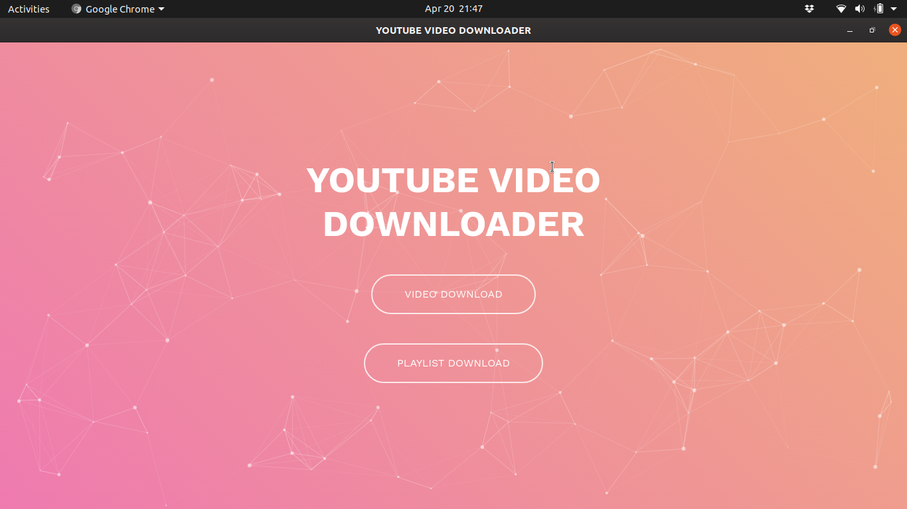

# YT_DOWNLOADER
A CROSS PLATFORM DESKTOP APPLICATION TO DOWNLOAD YOUTUBE VIDEOS AND PLAYLIST


# YT_DOWNLOADER

The simplest and fastest way to create applications with a Web UI and a Python backend.



## Getting Started
- Clone the repo and cd into the directory
```sh
$ git clone https://github.com/raj713335/YT_DOWNLOAD.git
$ cd YT_DOWNLOADER
```

- Install Eel, pytube3, , pyinstaller and easytkinter

```sh
$ pip install eel pytube3 pyinstaller easytkinter
```

- Run the app

```sh
$ python YT.py
```

## Packaging the app
You can pass any valid `pyinstaller` flag in the following command to further customize the way your app is built.
```sh
$ python -m eel YT.py web --noconsole --onefile --icon=barcode.icns
```

